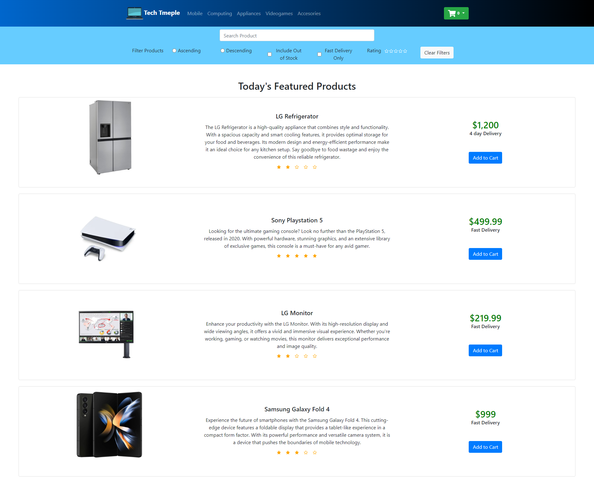
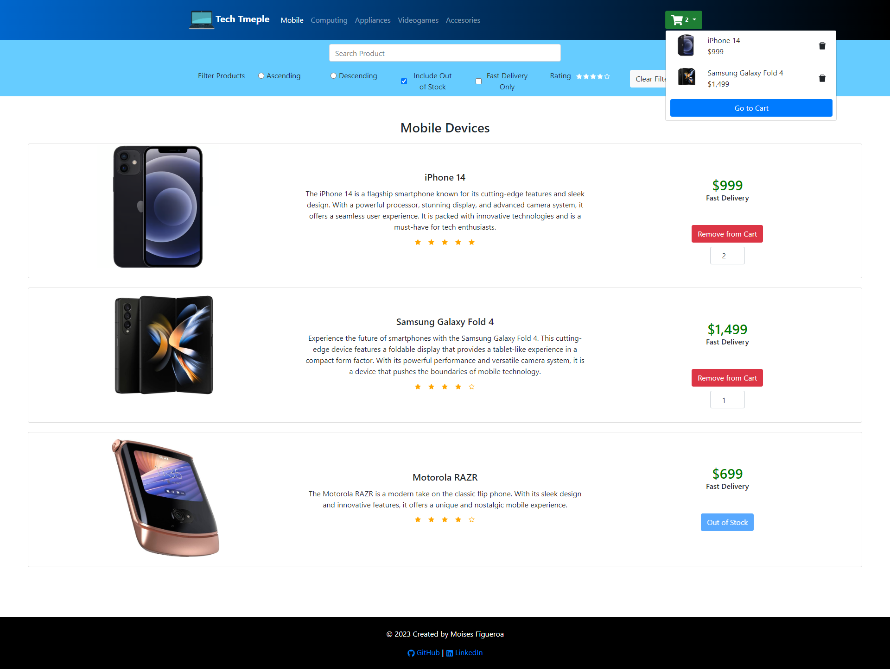

# Tech Temple

### This project is a technology eCommerce website built with React.
### This website allows users to filter products by different descriptions of the producs, such as, price (ascending or descending), can filter by fast delivery only products, includes out of stock items if needed, and last but not least the ability to filter the displayed products by the start rating.

### Other features of this website includes: 
* Product search, using the reducer feature of React, you can take a look at thie code, which also inclues the configurations for the filtes under the /context folder which includes the Context.js file as well as the Reducers.js file to accomplish the filtering of the products.
* Add to cart, and remove from cart actions direclty from the product card. This implementation is also under the ./context folder.
* Different pages have been implemented using react-router to facilitate the rendering of the page, instead of re-rendering the entire site.

### Follwing is a screenshot from the HomePage, this page renders the product objects that have the tag "featured" : true.

### The following screenshot displays the Mobile page. A few filtes have been set as well, such as the Include out of Stock, and rating of 4 and up. The only mobile devices that are shown are those with reating sof 4 and up, and an out of stock item is also shown per the filter.
### A few items have been added to the cart, a cart dropdown button displaying the products that have been added is shown on the top right corner as well.

### This last screenshot shows the page for the cart, here we see the items that have been added to the cart listed, as well as a total amount on the left side of the screen

