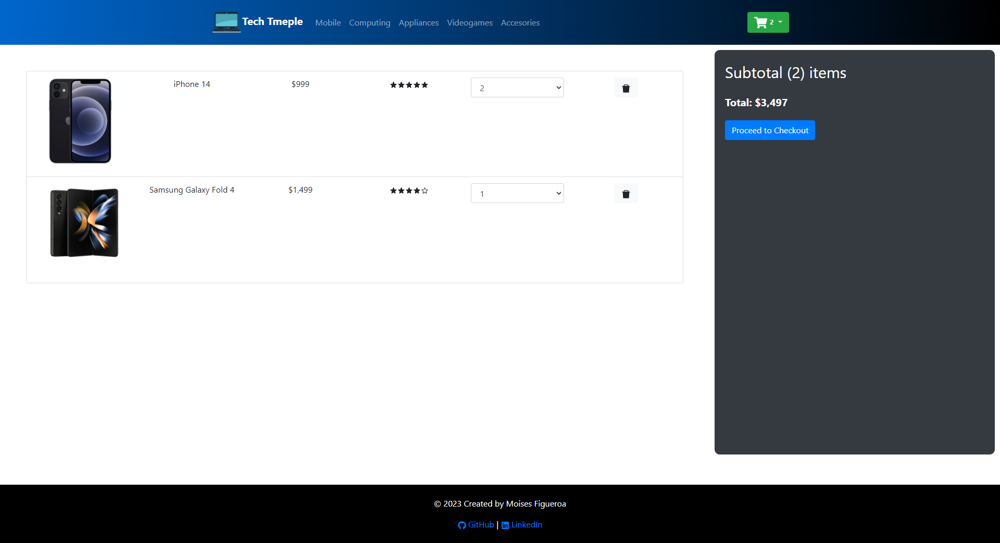

# Tech Temple

### This project is a technology eCommerce website built with React. The website allows users to filter products based on different criteria, such as price (ascending or descending), fast delivery only, including out of stock items, and filtering by star rating.

### Other features of this website include:
- Product search: The website uses the reducer feature of React to implement product search. The code for this feature, including the configurations for the filters, can be found under the /context folder, which includes the Context.js and Reducers.js files for filtering the products.
- Add to cart and remove from cart actions: These actions can be performed directly from the product card. The implementation for this feature is also located under the ./context folder.
- Page navigation: Different pages have been implemented using React Router to facilitate the rendering of individual pages without re-rendering the entire site.

### The following is a screenshot from the HomePage, which displays the product objects with the "featured" tag set to true:

### The following screenshot displays the Mobile page with applied filters, such as including out of stock items and a rating of 4 and above. Only mobile devices with a rating of 4 and above are shown, and an out of stock item is also displayed based on the applied filters. Additionally, a few items have been added to the cart, and a cart dropdown button displaying the added products is shown in the top right corner:

### This last screenshot shows the cart page, where the added items are listed along with a total amount displayed on the left side of the screen:

